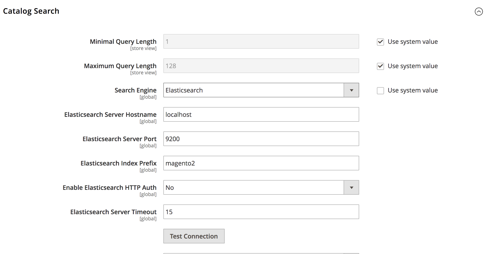

## Elasticsearch / Kibana / Marvel in one container

Simple and lightweight docker image for previewing Elasticsearch, Kibana & Marvel for montoring

### Usage

    docker run -d -p 9200:9200 -p 5601:5601 -p 9300:9300 andreipopovici/elasticsearch-kibana-marvel

Then you can:
 * connect to Elasticsearch by [http://localhost:9200](http://localhost:9200)
 * connect to Kibana front-end via  [http://localhost:5601/app/kibana](http://localhost:5601/app/kibana)
 * connect to Marvel front-end by [http://localhost:5601/app/marvel](http://localhost:5601/app/marvel)

Connect Magento to this box:
1. After you start up the image, make sure that your local Magento 2 setup uses "Elasticsearch". Check that in "Admin -> Stores -> Configuration", navigate to "Catalog -> Catalog" section "Catalog Search" and you should put these settings:


2. Click "test connection" and if all ok, save the config.
3. After that you need to populate the elasticsearch with Magento2 indices so run this 
from command line in magento root folder:
    ```cli
    php bin/magento indexer:reindex catalogsearch_fulltext
    ```
4. Marvel should just work out of the box. Open the page and you'll see graph populated.
    
5. When you navigate to Kibana panel the first thing to do is add the "Index name or pattern".

    In here untick "Index contains time-based events", add the indices. You can add for ex "magento2_product*".

    Magento creates indexes in elasticseach in a format: "<indexprefix>_product_<store_id>". Eg: "magento2_product_1", "magento2_product_2"

    The <indexprefix> is defined in config field "Elasticsearch Index Prefix"  and can be found in the Admin->System->Configuration: Catalog->Catalog->Catalog Search and by default is labeled "magento2"


### Tags

Tag     | Elasticsearch | Kibana | Marvel
------- | ------------- | ------ | ------
latest  | 2.4.3         | 4.6.3  | 2.4.5
